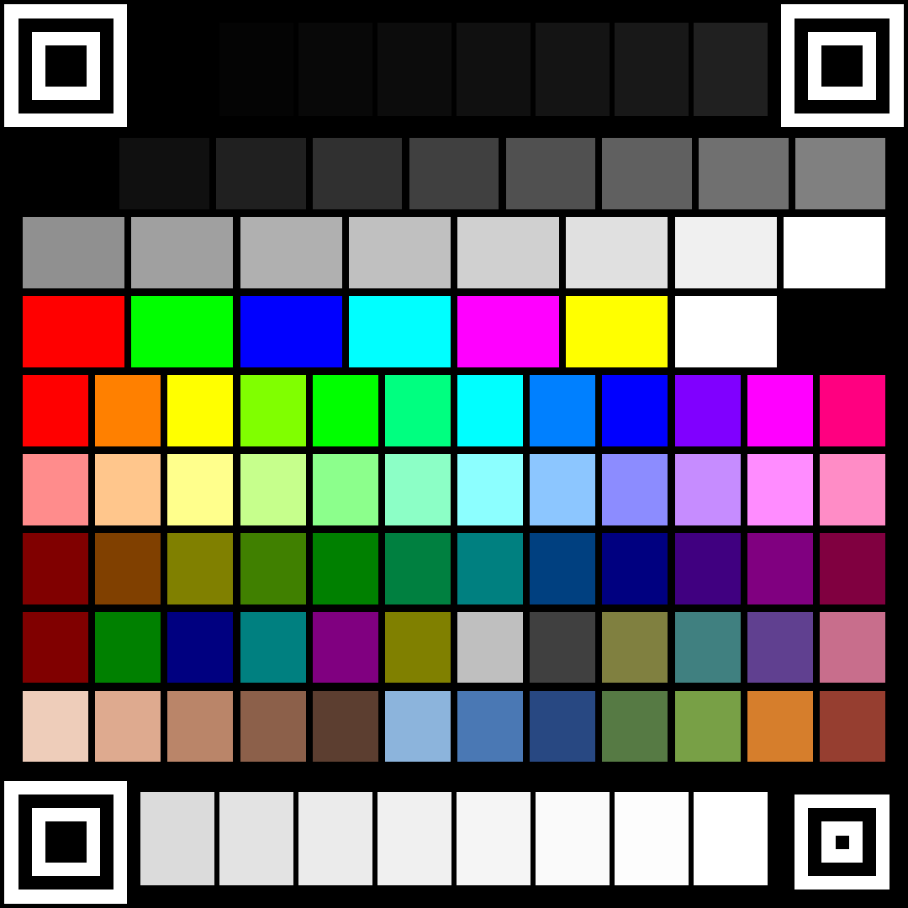

# CaptureInspector

USBキャプチャデバイスが「本来の解像度/FPSを出せない理由」を特定するツール。

OBS の「映像キャプチャデバイス」で解像度やFPSの選択肢が出てこないとき、
原因はドライバではなく **USBの接続経路** であることがほとんどです。
このツールはデバイスが申告しているフォーマット一覧と、
デバイスからホストコントローラーまでのUSB経路を突き合わせて、理由を日本語で表示します。

## 起動

```
CaptureInspector.bat
```

コンソール版（結果をテキストで貼りたいとき）:

```
.venv\Scripts\python.exe cli.py
```

## 画面

| タブ | 内容 |
|---|---|
| 診断 | 問題点と対処を重要度順に表示。OBSに入れる推奨設定も出す |
| 対応フォーマット | デバイスが申告する全フォーマット。OBSで選べるのはこの一覧が全て。USB2.0の帯域を超える行は赤 |
| USB接続 | デバイス→ハブ→ルートハブ→ホストコントローラーの経路と、確定したリンク速度 |
| プレビュー | 実際の映像。HDMI入力が来ているかの確認用 |

## テストチャート配布ページ

**https://haragurojyakku.github.io/capture-inspector/**

スマホからこのページを開けば、そのまま表示してキャプチャできます（保存も不要）。
画像を保存したい場合は 1080x1080 / 2160x2160 / 720x720 から選べます。

**チャートは正方形です。** 端末を縦に持っても横に持っても短辺いっぱいまで使えるので、
16:9 のチャートを縦持ちで表示したときに比べ、**1パッチあたりの面積がおよそ2倍**になります。
測定精度を決めるのは1パッチあたりの画素数なので、ここが効きます。

**完全な全画面表示は不要です。** 四隅のパターンが4つとも映っていれば、
表示サイズ・位置・傾きに関わらず検出・測定できます。



## 色校正

「送った色」と「返ってきた色」の差を実測し、原因を切り分けて補正LUTを生成します。
USB-C→HDMI直結のような純デジタル経路なら、測定対象は
**スマホのHDMI出力 + キャプチャの変換** の合成特性そのものです。

手順:

1. **① パターンを保存** — 101パッチの正方形チャートをPNGで出力（サイズは接続中のデバイスの短辺に合わせる）
2. スマホに転送し、**できるだけ大きく表示**（明るさ自動調整・Night Shift・画面の色調整はオフに）。
   写真ビューアなら画像をタップしてUIを隠してください
3. **③ 測定する** — 1フレーム取得して自動解析
4. **④ 補正LUTを保存** — `.cube` を出力。OBSの「LUTを適用」フィルタで読み込む

### 何を測っているか

### 位置合わせ（QR方式）

QRコードのファインダパターンを借りています。入れ子の正方形は、
中心を通るどの向きの走査線でも **暗:明:暗:明:暗 = 1:1:3:1:1** の比率で交差します。
比率を見るので、大きさにも角度にも依存しません。

左上・右上・左下に**ファインダパターン（7モジュール）**、
右下だけ**アライメントパターン（5モジュール）**を置いています。
QRコードと同じで、この非対称性が向きを決めます。

**形状だけで位置を決めているのが要点です。** 色でマーカーを識別すると、
色ズレを測る道具なのにその色ズレで位置合わせが不安定になります。
QR方式なら色がどれだけ狂っていても位置合わせは揺らぎません。

検出手順:

1. 輝度をOtsu法で2値化
2. 各行を走査し、ランレングスが 1:1:3:1:1 の比率に合う位置を拾う
3. その列を縦に走査して同じ比率を確認、クラスタに集約
4. 候補の組み合わせから、凸四角形かつ
   既知パッチ（黒/白/原色）の内容が一致するものを選び、
   4点で射影変換（ホモグラフィ）を構成

パッチの測色は、チャート座標のグリッドをホモグラフィで実画像へ写して行います。
軸並行の矩形を切り出す方式と違い、傾いていてもパッチ境界をまたぎません。

検証（合成画像・全て平均誤差 0.00 / 255、1フレームあたり 0.2〜0.4秒）:

| ケース | 1パッチの実測領域 | 結果 |
|---|---|---|
| 1080px（フレームの56%） | 39x42 px | ✅ |
| 800px / 600px | 29x31 / 22x23 px | ✅ |
| 420px / 300px | 15x16 / 11x12 px | ✅ |
| 隅にオフセット配置 | | ✅ |
| ブラウザUIバー・ステータスバーの写り込み | | ✅ |
| 白い背景の上 | | ✅ |
| 90° / 180° / 270° 回転 | | ✅ |
| 8° 傾き | | ✅ |
| **縦持ちスマホのミラーリング（全幅表示）** | 18x19 px | ✅ |
| 縦持ちスマホ（画面幅の70%） | 12x13 px | ✅ |

220px（1パッチ8px相当）以下は検出できません。もっともその大きさでは
色差の圧縮で測定値自体が使い物にならないため、実用上の下限はもっと手前にあります。

### パッチ構成

全 101 パッチ / 10 行:

| 行 | 内容 | 分かること |
|---|---|---|
| グレー17段 | 0〜255（2行に分割） | 黒レベル・白レベル・ガンマ・チャンネル別ゲイン |
| 黒端 8段 | 0,4,8,12,16,20,24,32 | 暗部のクリップ（潰れ） |
| 白端 8段 | 219〜255 | 明部のクリップ（飛び） |
| 原色 8色 | RGBCMY+白黒 | 色域の頂点 |
| 色相 12色 | 彩度100% 明度100% | 色相回転の検出 |
| 色相 12色 | 彩度45%（淡） | マトリクスのフィット用（色域外に出にくい） |
| 色相 12色 | 明度50%（濃） | 暗部での色相ずれ |
| 中間色 12色 | 50%原色・グレー・混色 | 中間輝度での線形性 |
| 記憶色 12色 | 肌5・空3・緑2・橙・煉瓦 | 実用上の色ズレ |

色相を等間隔に並べているのは、マトリクス誤差が**色相環全体を回転させる**ためです。
手選びの色より、等間隔サンプルの方が回転を見つけやすくフィットも安定します。

黒レベル・白レベル・ガンマは互いに影響するため独立には求まりません。
そこで `value = black + span × (ref/255)^gamma` をガンマについて掃引し、
各点で線形項を最小二乗で解く**同時推定**を行っています。
直線フィットではガンマ曲線を黒レベルのずれとして誤読します。

### 補正モデル

誤差を2段に分解して補正します。

1. **チャンネル別トーンカーブ** — グレー階調から作る。黒レベル・白レベル・ガンマを直す
2. **3x3 マトリクス** — トーン補正後に残った線形成分。色相を直す

BT.709で符号化してBT.601で復号する、といったマトリクス不一致は、
ガンマ符号化されたRGB空間上の**単一の線形変換**です。かつ両者の輝度係数は
和が1なので**無彩色軸を動かしません**。だからグレー階調がトーン誤差を、
カラーパッチが残りのマトリクス誤差を、それぞれ独立に捉えられます。

出力するLUTは自動で選ばれます。

- マトリクス誤差が軽微 → **1D LUT**（格子補間の誤差がなく、レベル/ガンマには厳密）
- 色相ずれあり → **3D LUT**（トーンカーブ + マトリクス）

1D LUT は原理的に色相を変えられないため、マトリクス誤差には無力です。

#### 検証

既知の劣化を注入した合成テストで、注入値をどれだけ復元できるか確認しています。

| 注入した劣化 | 結果 |
|---|---|
| なし（完全な系） | 黒 0.00 / 白 255.00 / ガンマ 1.0000 — 誤警報なし |
| リミテッドレンジ + ガンマ1.18 + ゲイン | 黒 15.64 / ガンマ 1.1833 を復元。LUT後 平均誤差 18.94 → **0.13** |
| BT.709符号化 / BT.601復号 | 推定マトリクスが理想の逆行列と**完全一致**（最大誤差 0.00000） |

マトリクスのフィットでは、いずれかのチャンネルが 0 または 255 に張り付いた
パッチを除外しています。クランプされた値は変換先の情報を持たないため、
含めるとフィットが大きく歪みます（除外前は理想値から 0.124 ずれていました）。
彩度の低い行を用意しているのは、この除外を通り抜けて残るサンプルを確保するためです。

### 重要な順序

**レンジ設定で直る問題を、LUTで塗り潰さないでください。**
「リミテッドレンジがそのまま出力されています」と出た場合は、
まず OBS のソースのプロパティで「色範囲」を『一部』に変えてから再測定します。
LUTが必要なのはそれでも残る誤差だけです。クリップ（潰れ・飛び）は
情報が失われているため、LUTでは復元できません。

## デバイスの再初期化

上部の「デバイスを再初期化」ボタンで、デバイスを無効化→有効化します。
**USBケーブルを抜き差しするのと同じ効果**で、「認識しない」「映像が出なくなった」系の
トラブルで最初に試す価値のある操作です。

- 対象は個別のインターフェース(カメラ/音声)ではなく、その親の **composite デバイス**。
  カード全体が再列挙されます
- 実行時に **UAC（管理者権限）の確認**が出ます。アプリ自体は非管理者で動きます
- 実行前に確認ダイアログが出ます。**録画・配信中は実行しないでください**（映像が途切れます）
- 完了後、数秒待って自動で再スキャンします

内部的には `pnputil /restart-device "<instance ID>"` を昇格プロセスとして実行しています。

## 仕組み

- **フォーマット列挙**: DirectShow の `IAMStreamConfig::GetStreamCaps` を叩く（OBSが読むのと同じ情報源）
- **USB経路**: `cfgmgr32` の `CM_Get_Parent` で親をたどり、PCIホストコントローラーまで到達
- **速度判定**: 経路上に `ROOT_HUB20` / EHCI (Enhanced Host Controller) があれば USB 2.0 確定。
  `ROOT_HUB30` / xHCI (eXtensible Host Controller) なら USB 3.x 可能
- **帯域計算**: `幅 × 高さ × 画素あたりバイト数 × fps × 8`。USB2.0の実効帯域(約360Mbps)と比較
- **プレビュー**: DirectShow の SampleGrabber。フレームはDirectShowのストリーミングスレッドで
  届くが、Tkinterは別スレッドから触れないため、コールバックは最新フレームを置くだけにして
  描画はTkのタイマー(`after`)で行う。ワーカースレッドでは `CoInitialize` が必須

判定にPowerShellを使わないので、スキャンは一瞬で終わります。

## 構成

```
capture_inspector/
  usb_topology.py   cfgmgr32でデバイスツリーを遡る
  devices.py        DirectShowのデバイスとフォーマット列挙
  diagnose.py       事実 → 日本語の所見に変換
  device_control.py pnputil経由の再初期化（UAC昇格つき）
  calibration.py    テストチャート生成・測定・LUT生成
  gui.py            Tkinter UI
cli.py              テキスト版レポート
CaptureInspector.bat / .pyw   起動用
```

## 依存

`.venv` に同梱済み: `pygrabber`, `numpy`, `pillow`

再構築する場合:

```
python -m venv .venv
.venv\Scripts\python.exe -m pip install pygrabber numpy pillow
```
